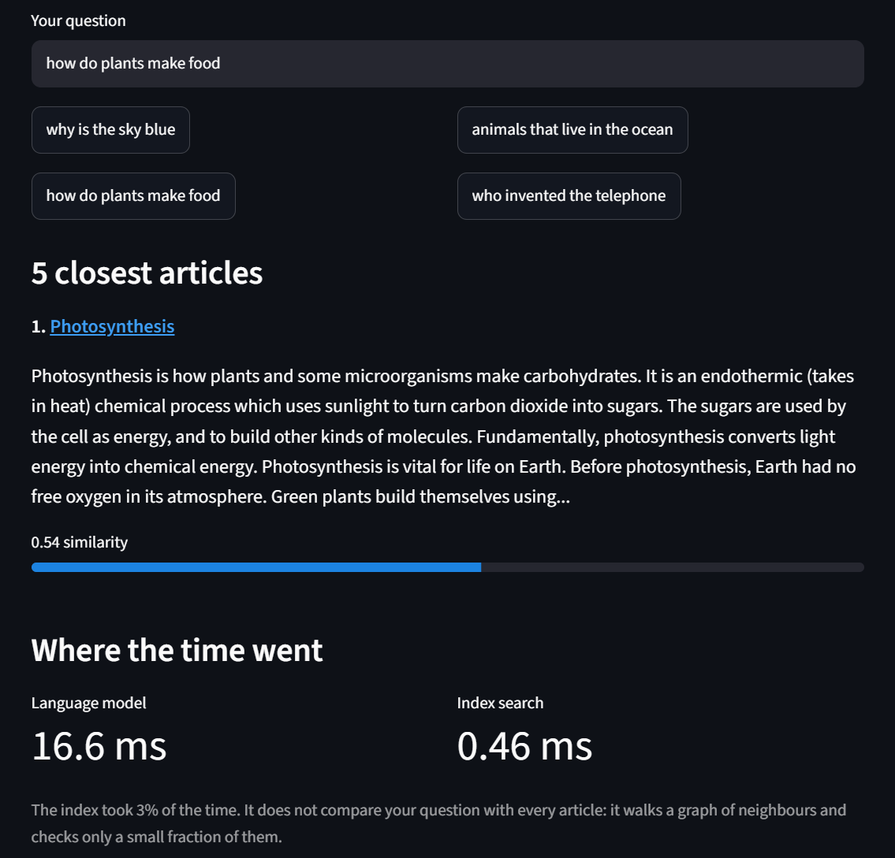
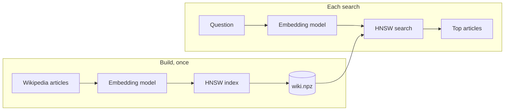

# Vector Search Engine

An approximate nearest-neighbour search engine written from scratch: an HNSW index in Python, compiled with Numba, benchmarked against FAISS, and used to serve semantic search over 100,000 Wikipedia articles.

**[Try the live demo](https://vector-search-engine.streamlit.app/)** (it may take a minute to wake up if nobody has used it recently)



## Highlights

- **HNSW implemented from the paper**, with no search library inside the index: layered graph, best-first search, and the neighbour-selection heuristic.
- **34x faster build** after profiling the pure-Python version and compiling its hot loops with Numba.
- **On par with FAISS on a single thread**: recall within 0.008 at every setting, and a build time within 6%.
- **21x faster than exact search** at 100,000 vectors, at 97% recall.
- **Real workload**: semantic search over 100,000 Simple English Wikipedia articles, where the index answers in about 0.5 ms.
- **23 tests**, including checks against an exact baseline and a save/load round trip.

## Results

All numbers were measured on a 4-thread laptop CPU (Windows 11, Python 3.13, no GPU). The synthetic benchmarks use 128-dimensional clustered vectors, `M = 16`, `ef_construction = 100` and `k = 10`.

### HNSW against exact search

Exact search compares the query with every vector, so its cost grows with the data. HNSW's stays almost flat.

| Vectors | Build (s) | Exact (ms/query) | HNSW (ms/query) | Speed-up | Recall@10 |
|---:|---:|---:|---:|---:|---:|
| 10,000 | 1.3 | 0.40 | 0.15 | 2.6x | 1.000 |
| 25,000 | 3.3 | 0.94 | 0.17 | 5.7x | 1.000 |
| 50,000 | 7.7 | 1.46 | 0.13 | 11.1x | 0.996 |
| 100,000 | 19.2 | 3.11 | 0.15 | 21.1x | 0.970 |

`ef_search = 50`, 200 queries. Reproduce with `python -m benchmarks.bench_scaling`.

### Against FAISS

Same 100,000 vectors, same graph settings, one CPU thread each, one query at a time.

| | This project | FAISS `IndexHNSWFlat` |
|---|---:|---:|
| Build time | 18.2 s | 17.1 s |

| `ef_search` | Recall@10 (this project) | ms/query | Recall@10 (FAISS) | ms/query |
|---:|---:|---:|---:|---:|
| 10 | 0.686 | 0.074 | 0.693 | 0.056 |
| 20 | 0.841 | 0.105 | 0.849 | 0.103 |
| 50 | 0.968 | 0.208 | 0.969 | 0.153 |
| 100 | 0.994 | 0.236 | 0.995 | 0.258 |
| 200 | 0.998 | 0.455 | 0.998 | 0.415 |

500 queries. Reproduce with `python -m benchmarks.bench_faiss`.

This comparison is single-threaded on purpose. FAISS can build and search across all cores and this index cannot yet, so on a real multi-core workload FAISS is faster. The matching recall is the stronger claim: it shows the graph this code builds is as good as the reference implementation's.

### From pure Python to Numba

The first version was plain Python with NumPy distance calls. Each insert runs roughly `ef_construction` graph-expansion steps, and each step was a few tiny NumPy calls plus heap operations, so the time went to interpreter overhead and not to arithmetic. Rewriting the hot loops as array-only functions and compiling them with Numba removed that overhead.

| | Pure Python | Numba | Change |
|---|---:|---:|---:|
| Build, 10,000 vectors | 44.5 s | 1.3 s | 34x |
| Build, 100,000 vectors | 517.1 s | 19.2 s | 27x |
| Query, 100,000 vectors | 1.17 ms | 0.15 ms | 8x |
| Recall@10, 100,000 vectors | 0.970 | 0.970 | unchanged |

Both versions are in the commit history, and the unchanged recall reflects that the compiled version builds the same graph.

### On real data

100,000 Simple English Wikipedia articles, embedded into 384 dimensions with `all-MiniLM-L6-v2`.

| | |
|---|---:|
| Index build | 41.2 s |
| Index file | 183 MB |
| Index search per query | 0.35 to 0.62 ms |
| Embedding the query | 9 to 17 ms |

The index is about 3% of the time per search. In a real system the embedding model is the bottleneck, not the vector index.

## How it works



HNSW (Hierarchical Navigable Small World) stores every vector as a node in a stack of graphs.

- **Layer 0** holds every vector, each linked to its nearest neighbours.
- **Upper layers** hold exponentially fewer vectors, so their links cover long distances.
- **Searching** starts at the top, greedily walks towards the query, drops a layer, and repeats. On layer 0 it keeps the best `ef_search` candidates and returns the closest `k`.
- **Inserting** a vector picks a random top layer for it, searches for its neighbours on each layer, and links them in both directions.

| Setting | Meaning | Trade-off |
|---|---|---|
| `M` | Links per node | Higher: better recall, more memory |
| `ef_construction` | Candidates considered while building | Higher: better graph, slower build |
| `ef_search` | Candidates tracked per query | Higher: better recall, slower queries |

## Design decisions

- **Array-only storage.** Layer 0 links live in one fixed-width matrix (row = node), and upper layers in a second, addressed by an offset per node. This is what lets Numba compile the search loop.
- **Visited tags, not a set.** `visited[node] == tag` marks a node as seen in the current search. Bumping the tag starts a new search without clearing an array.
- **Neighbour-selection heuristic.** A candidate is kept only if it is closer to the new node than to every neighbour already kept. This spreads links in different directions and keeps the graph navigable.
- **Benchmarks use clustered data.** Uniformly random high-dimensional vectors are nearly equidistant, which makes them a poor test for any nearest-neighbour index. Real embeddings are clustered, so the benchmarks are too.
- **Safe persistence.** The index saves to a single `.npz` file loaded with `allow_pickle=False`. The random generator's state is saved too, so an index that is saved, loaded and extended builds the same graph as one that was never saved. A test checks this.
- **A lock around search in the service.** The `visited` array and the tokenizer are shared, so concurrent requests take turns.

## Using the index

```python
import numpy as np
from vsearch.hnsw import HNSWIndex

index = HNSWIndex(dim=128, metric="cosine", M=16, ef_construction=100)
index.add(vectors)                       # float32 array of shape (n, 128)
ids, distances = index.search(query, k=10, ef_search=50)

index.save("my_index.npz")
index = HNSWIndex.load("my_index.npz")
```

## Running it

```bash
git clone https://github.com/aarnarathod114-lab/vector-search-engine.git
cd vector-search-engine
python -m venv venv
venv\Scripts\activate            # Windows; on macOS or Linux: source venv/bin/activate
pip install -r requirements.txt

python -m pytest -q                      # 23 tests
python -m benchmarks.bench_scaling       # HNSW against exact search
python -m benchmarks.bench_faiss         # HNSW against FAISS
```

To search Wikipedia, either build the index yourself (about an hour of embedding on a laptop CPU, and it resumes if interrupted) or download `wiki.npz` and `wiki_docs.json` from the [index-v1 release](https://github.com/aarnarathod114-lab/vector-search-engine/releases/tag/index-v1) into a `data` folder.

```bash
python -m scripts.build_index --limit 100000         # build the index
python -m scripts.search "how do plants make food"   # search from the terminal
python -m uvicorn app.main:app --port 8000           # API and web page at http://127.0.0.1:8000
python -m streamlit run demo/streamlit_app.py        # the hosted demo, locally
```

### API

| Endpoint | Purpose |
|---|---|
| `GET /search?q=...&k=5&ef_search=50` | Ranked articles with similarity scores and timings |
| `GET /stats` | Index size and settings |
| `GET /docs` | Interactive API documentation |

## Project layout

```
vsearch/       the library: brute_force.py (exact baseline) and hnsw.py (the index)
tests/         23 tests for both indexes
benchmarks/    recall, scaling and FAISS comparisons
scripts/       build the Wikipedia index, search it from the terminal
app/           FastAPI service and its web page
demo/          Streamlit app behind the live demo
```

## Limitations and next steps

- **Single-threaded.** Build and search use one core. A per-thread `visited` array would allow parallel searches and remove the service's lock.
- **No deletes or updates.** Vectors can only be added.
- **In memory only.** The whole index is loaded into RAM, and ids are stored as 64-bit integers, which is more than this scale needs.
- **Recall on real embeddings is not yet measured.** The recall figures above are for synthetic clustered data. Measuring recall on the Wikipedia embeddings against exact search is the next benchmark to add.
- **The Dockerfile is untested.** It is written for the FastAPI service but has not been built or deployed yet. The live demo runs on Streamlit Community Cloud.

## References

- Yu. A. Malkov and D. A. Yashunin, [Efficient and robust approximate nearest neighbor search using Hierarchical Navigable Small World graphs](https://arxiv.org/abs/1603.09320)
- [FAISS](https://github.com/facebookresearch/faiss), used here only as a benchmark
- Article text is from [Simple English Wikipedia](https://simple.wikipedia.org/), available under a Creative Commons Attribution-ShareAlike licence